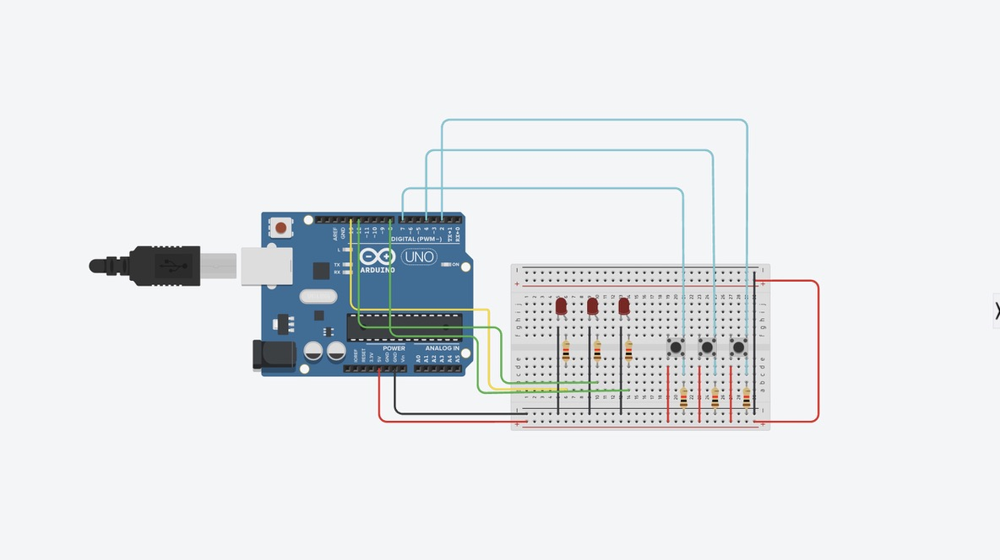
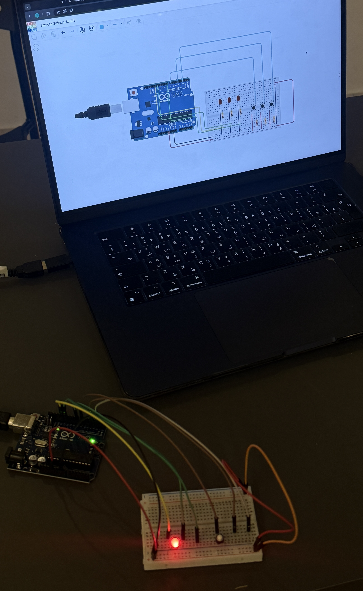

#  LED Control Using Push Button | Arduino Project 🔴 


This beginner-friendly Arduino project demonstrates how to control an LED using a push button. It introduces fundamental concepts of digital input/output, conditional logic, and basic timing with `delay()`.

---

##  Project Description : 

When the push button is pressed, the Arduino turns **ON** an LED for a defined duration (1 second), and then turns it **OFF**.  
This is a great entry-level project to practice working with **buttons, LEDs**, and **simple logic control** using Arduino.

---

##  Components Used :

| Component          | Quantity   |
|--------------------|------------|
| Arduino UNO        | 1          |
| LED (any color)    | 1          |
| 220Ω Resistor      | 1          |
| Push Button        | 1          |
| Breadboard         | 1          |
| Jumper Wires       | As needed  |
| USB Cable          | 1          |

---

##  Circuit Connections 

### 🔴 LED:
- **Anode (+)** → Digital Pin **13** *(via 220Ω resistor)*  
- **Cathode (−)** → **GND**

### 🔘 Push Button:
- One leg → Digital Pin **2**  
- Other leg → **GND**

> ℹ️ Make sure the button is properly placed across the breadboard center gap.  
> Use **internal pull-down logic** or **debounce code** for more stable behavior in real-world applications.

---

##  Arduino Code Explanation :

```cpp
// 🔧 Define pin numbers
int ledPin = 13;
int buttonPin = 2;
int buttonState = 0;

void setup() {
  // 🛠️ Set pin modes
  pinMode(ledPin, OUTPUT);
  pinMode(buttonPin, INPUT);
}

void loop() {
  // 📥 Read the button state
  buttonState = digitalRead(buttonPin);

  // ⚡ If button is pressed, turn LED ON for 1 second
  if (buttonState == HIGH) {
    digitalWrite(ledPin, HIGH);
    delay(1000); // 🕒 LED stays ON for 1 second
  } else {
    // 💡 Otherwise, turn LED OFF immediately
    digitalWrite(ledPin, LOW);
  }
}
```


##  Output Behavior :

-  **When the push button is pressed**:  
  ➤ The LED turns **ON for 1 second**.

-  **When the button is released**:  
  ➤ The LED turns **OFF immediately**.

---

## 📸 Visual Aid :

### 🔷 TinkerCad Simulation  


### 🔷 Real Hardware (Breadboard Setup)  



---

##  Notes :

-  You can **adjust the ON duration** by changing the `delay()` value (in milliseconds).
-  Always use a **current-limiting resistor** to protect your LED.
-  Use **debounce logic** in real-world setups to prevent signal noise from mechanical buttons 🧠 .

---

##  Learning Outcomes : 

- Understanding digital input/output with Arduino  
- Working with push buttons and LEDs  
- Implementing conditional logic and delays  
- Building and simulating circuits using TinkerCad  

---

##  Future Improvements :

-  Add a **second LED** for more visual feedback  
-  Use `millis()` instead of `delay()` for **non-blocking code**  
-  Implement a **toggle mechanism**:  
  ➤ Press once = LED ON  
  ➤ Press again = LED OFF  
-  Add a **buzzer or sound alert** for audio feedback 🔊
